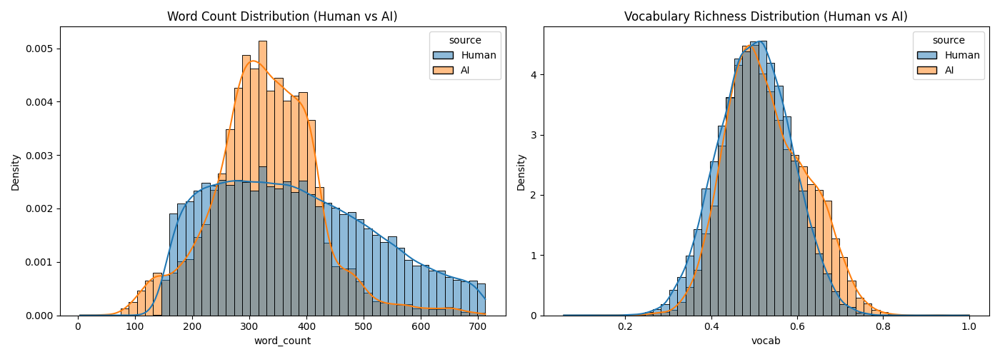
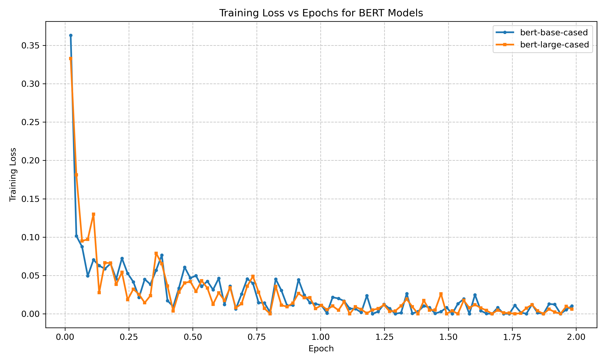

# Assignment 2: Detect AI Generated Text

## Part 1: Data Exploration and Baseline Performance

### Text Statistics
Visual analysis of the dataset reveals distinct patterns between Human and AI-generated texts:
- **Word Count**: AI-generated texts are tightly concentrated around 300-400 words, reflecting the token length constraints or default behaviors of LLMs. Human texts exhibit a much broader and more natural distribution.
- **Vocabulary Richness**: AI models show a dense concentration around a ratio of 0.5, while human writers display a slightly wider variance, including a longer tail of vocabulary diversity.

### Baseline Model
A traditional TF-IDF approach achieved an exceptional **ROC-AUC of 0.9987**. This indicates that the dataset contains easily separable statistical lexical patterns, likely due to specific words or n-grams over-represented in AI generations.

---

## Part 2: BERT Fine-Tuning & Scaling

### Model Configurations
Two BERT architectures were fine-tuned for Sequence Classification using the Hugging Face `transformers` library (Label 0 = Human, Label 1 = AI):
1. **Model A (Base)**: `bert-base-cased` (110M parameters). Training utilized a batch size of 16 on the A100.
2. **Model B (Large)**: `bert-large-cased` (340M parameters). To accommodate the significant VRAM requirements of the 340M parameter model, a batch size of 16 was used. 

Both models heavily utilized **fp16 (mixed precision)** to maximize batch sizes, accelerate training speed, and prevent Out-of-Memory (OOM) errors on the A100.

### Training Convergence
Both models exhibited rapid convergence:
- **`bert-base-cased`**: Training loss decreased from 0.3631 to 0.0279 within the end of the second epoch.
- **`bert-large-cased`**: Training loss converged from 0.3329 down to 0.01915 within the end of the second epoch.

### Performance Comparison & Scaling Analysis

Both models were evaluated using the ROC-AUC metric on a held-out validation set.

| Model | ROC-AUC | Training Time (s) | Training Speed (samples/s) |
| :--- | :--- | :--- | :--- |
| **TF-IDF Baseline** | 0.9987 | N/A | N/A |
| **BERT-Base (110M)** | 0.99988 | 413.0 | 173.8 |
| **BERT-Large (340M)** | 0.99989 | 1032.0 | 69.6 |

**Hypothesis & Scaling Conclusion: Does the Large model significantly outperform the Base model?**
No, the Large model does **not** significantly outperform the Base model on this specific task. 
While BERT-Large achieves a negligible 0.00001 improvement in ROC-AUC, the training time more than doubles (from 413s to 1032s), and throughput drops by 60%. 

**Why?** The fundamental reason is that the task is "too easy" relative to the dataset. The TF-IDF baseline already achieved a 0.9987 ROC-AUC, indicating that AI-generated texts contain simple, glaring lexical patterns (e.g., specific repetitive vocabulary). Because the base 110M parameter model is already more than capable of capturing these straightforward statistical cues and saturating the metric scope (~0.99988), the extra 230M parameters of the Large model offer no meaningful semantic advantage, serving only to waste computational resources.

---

## Part 3: Adversarial Attack via Local LLM

### Experimental Setup
- **Attacker LLM**: `meta-llama/Meta-Llama-3-8B-Instruct`
- **Target Detector**: Fine-tuned `bert-base-cased`
- **Attack Strategy**: We initially prompted the LLM to rewrite validation set essays (Human) in a high school student's casual style. After discovering inherent formatting flaws, we reinforced the System Prompt to strictly forbid conversational filler.

### Adversarial Findings & Analysis

**1. The "Conversational Filler" Flaw (0% Success Rate)**
Initial attacks failed completely because instruction-tuned LLMs inherently generate conversational fillers (e.g., *"Here's a rewritten version of the essay..."*). Because the BERT model processes up to 512 tokens, it effortlessly latched onto these distinct instruction-following artifacts, bypassing any semantic evaluation of the essay itself. The detector classified all 10 samples as AI-generated with >0.9990 confidence.

**2. The System Prompt Fix (10% Success Rate)**
To genuinely test the detector's limits, we applied a strict negative constraint in the System Prompt: *"Output ONLY the rewritten text. Do not include any conversational filler..."*

This successfully stripped the predictable metadata formatting, forcing the detector to evaluate the raw prose. As a result, the attack successfully fooled the model on one sample.

**Successful Attack Example (Sample #4419)**:
- **Original Content**: *"The using of cars has caused much of the worlds green house gas imitions..."*
- **Generated Attack snippet**: *"Cars are really hurting the environment, especially in America where transportation is responsible for like 50% of greenhouse gas emissions. A lot of people think this is super bad..."*
- **Detector Prediction**: **Human-Written**
- **Confidence (AI Class)**: **0.0035**

**Why BERT Failed**:
Once the AI-like greetings (*"Here's a rewritten..."*) were removed, BERT had to evaluate the actual essay content. By mimicking a high schooler's casual vocabulary (e.g., *"super bad"*, *"really hurting"*) and slightly imperfect phrasing, Llama-3 successfully hid its usual "perfect" structural patterns. This shows that while BERT easily catches standard AI texts, it can still be bypassed if the LLM is explicitly prompted to replicate human imperfection.
